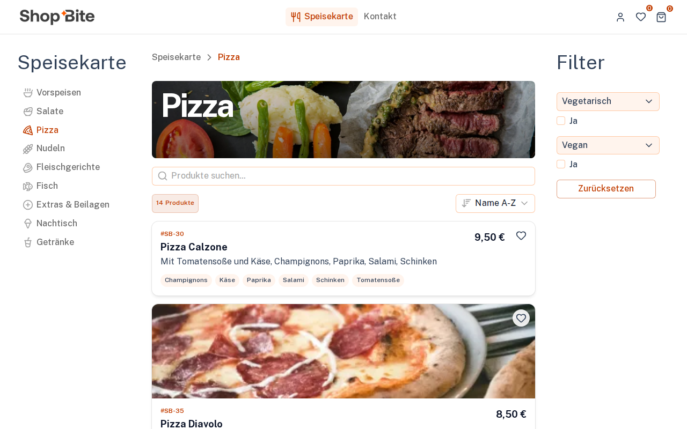

<div align="center">

# 🍕 ShopBite

**Open source online ordering for restaurants, running on your machine in one command.**

Shopware 6 · ShopBite plugin · Nuxt storefront · demo menu included



</div>

## Quick start

You need [Docker](https://docs.docker.com/get-docker/) with Compose (Docker Desktop on macOS and Windows) and about 4 GB of free RAM.

```bash
git clone https://github.com/shopbite-de/shopbite.git
cd shopbite
docker compose up -d
```

The first start downloads the images and installs Shopware, which takes a few minutes. Then open:

| What                  | URL                          | Login               |
| --------------------- | ---------------------------- | ------------------- |
| 🛒 Storefront         | http://localhost:3000        |                     |
| ⚙️ Shopware Admin     | http://localhost:8000/admin  | `admin` / `shopbite` |
| ✉️ Mails (Mailpit)    | http://localhost:8025        |                     |

That's it. You get a restaurant shop with 71 dishes in 9 menu sections, pizza sizes, extras, side dishes, vegetarian and vegan badges, opening hours and a working checkout. Order a pizza and the confirmation mail shows up in Mailpit.

Follow the first start with `docker compose logs -f setup`. When it prints `storefront config written`, the shop is ready.

## Things to try

- **Order something.** Pick a pizza, add extras, check out as a guest. The order appears in the Admin under *Bestellungen*.
- **Change the menu.** Edit a price or a dish in the Admin (*Kataloge > Produkte*). The storefront shows the change after a minute or two.
- **Set your opening hours.** *ShopBite > Öffnungszeiten* in the Admin menu (the demo is open around the clock). Add a holiday under *Feiertage* and the storefront shows the shop as closed.
- **Start with an empty menu.** `SEED_DEMO_MENU=0 docker compose up -d` on a fresh install creates the sales channel without the demo dishes.

## What's inside

```
docker compose up
 ├─ shopware    Shopware 6.7 with the ShopBite plugin     :8000
 │   ├─ init       installs Shopware / runs updates on every start
 │   ├─ worker     message queue (mails, indexing, thumbnails)
 │   └─ scheduler  scheduled tasks
 ├─ setup       sales channel, opening hours and demo menu (setup/menu.json)
 ├─ storefront  ShopBite Nuxt storefront                   :3000
 ├─ database    MariaDB 11.8
 ├─ valkey      cache, carts, sessions
 └─ mailpit     catches all outgoing mails                 :8025
```

| Repository | What it is |
| --- | --- |
| [storefront](https://github.com/shopbite-de/storefront) | Nuxt 4 storefront, also a Nuxt layer for your own shop |
| [shopware-plugin](https://github.com/shopbite-de/shopware-plugin) | Shopware plugin: opening hours, holidays, extras, checkout rules |
| [shopware](https://github.com/shopbite-de/shopware) | Shopware project and production Docker setup |
| [order-printer](https://github.com/shopbite-de/order-printer) | Prints new orders on a thermal receipt printer |

## Everyday commands

```bash
docker compose ps              # status of all services
docker compose logs -f setup   # watch the first start
docker compose pull            # get the newest images
docker compose up -d           # start or update
docker compose down            # stop (data stays)
docker compose down -v         # stop and delete all data, next start is a fresh install
```

## Configuration

Everything works without configuration. To change the admin password, the shop name or other values, copy `.env.example` to `.env` and edit it before the first start.

Ports 3000, 8000 and 8025 must be free. They are fixed on purpose: the storefront shares the network of the Shopware container, so `http://localhost:8000` points to Shopware for your browser and for the server-side rendering alike.

### Build the images yourself

The images are built from the repositories above by [a GitHub workflow](.github/workflows/images.yaml). To build them locally instead (10 to 20 minutes):

```bash
docker compose -f compose.yaml -f compose.build.yaml up -d --build
```

## Going live

This stack is made for trying ShopBite locally. It uses fixed secrets and plain HTTP. For a real shop, follow the [documentation](https://shopbite.de/docs/intro): the production setup in [shopbite-de/shopware](https://github.com/shopbite-de/shopware) adds TLS, S3 storage and backups, and the storefront runs as your own Nuxt project on top of the ShopBite layer.

## Troubleshooting

- **The storefront shows an error right after `up`:** the first installation is still running. Wait for `docker compose logs setup` to finish.
- **`port is already allocated`:** another program uses port 3000, 8000 or 8025. Stop it and run `docker compose up -d` again.
- **Something is broken after experimenting:** `docker compose down -v && docker compose up -d` starts from scratch.

## License

[MIT](LICENSE)
